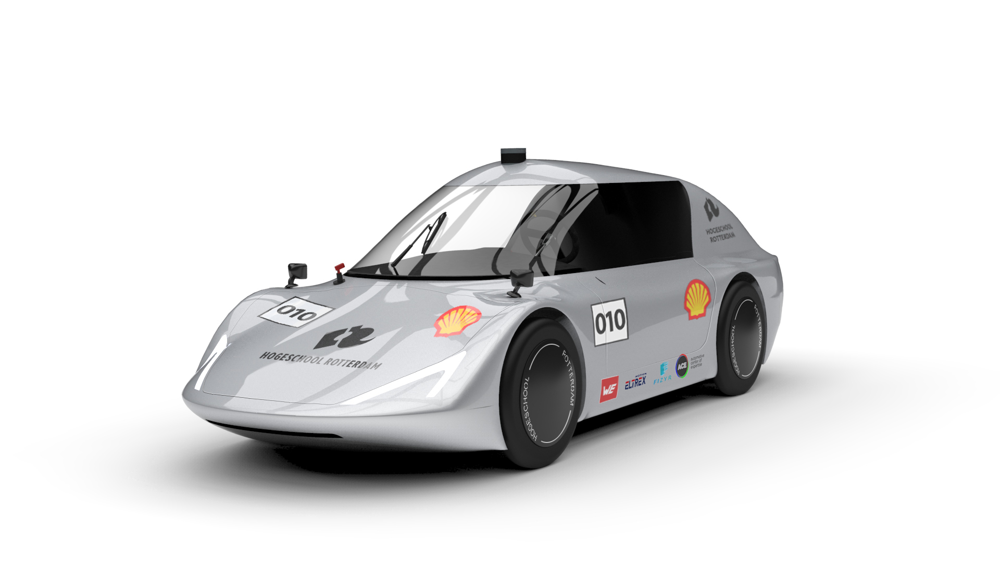
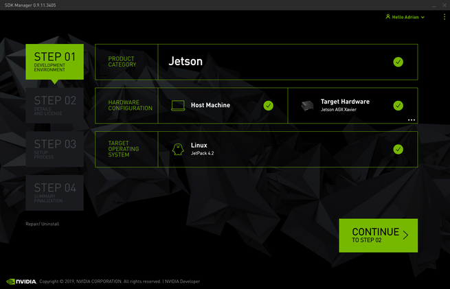
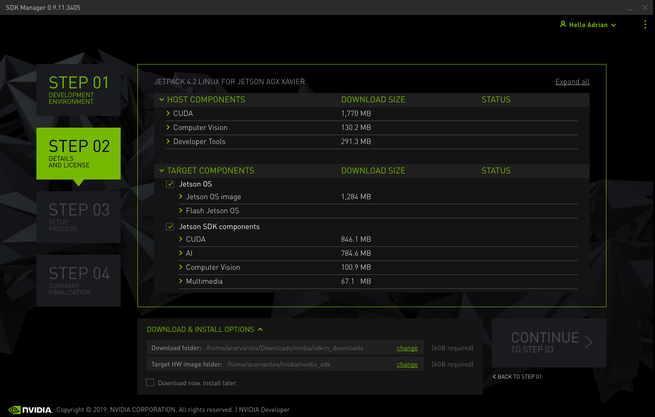
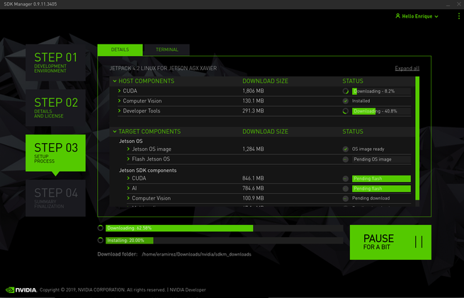
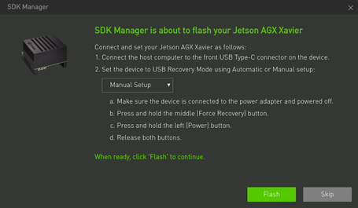
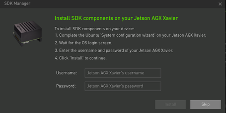
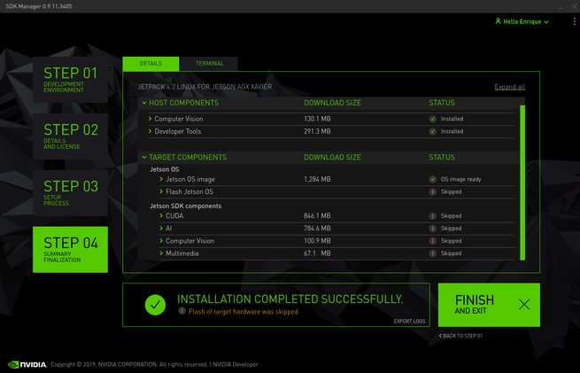

# Phidippides
With the Quadriga, Team Phidippides wants to bring a practical electric city vehicle focused on innovation in future mobility.
The Quadriga will completely be designed by students of the Rotterdam University of Applied Sciences.
To achieve autonomous driving the Quadriga will use a LiDAR and Stereo Camera to scan the environment and drive on its own.

This repository includes every resource we gathered so far in therms of the autonomous driving of the Quadriga.

## Installation
- Clone this repository.
- Follow the instructions given.

## Xavier
At this moment in time all installation is already done on the Xavier.

### Usage
- Username: `xavier`
- Password: `a`
- ROS directory: `/home/xavier/ros`

### Installation
_This is only necessary when a clean install is mandatory_ 
#### Requirements
- [NVIDIA Jetson AGX Xavier Developer Kit](https://developer.nvidia.com/embedded/jetson-agx-xavier-developer-kit%20%20%20)
- [Zed Camera](https://www.stereolabs.com/)
- [Robosense RS-LiDar-16](https://www.robosense.ai/en/rslidar/RS-LiDAR-16)
- A PC with internet, USB port and (optional) NVIDIA CUDA capable GPU

#### UBUNTU LTS 18.04
In case of a full reinstallation of the OS, a computer with linux is needed to flash the OS for the Xavier.
More information about the OS is found here [NVIDIA Jetson AGX Xavier Developer Kit](https://developer.nvidia.com/embedded/jetson-agx-xavier-developer-kit%20%20%20)

The only supported operating systems supported by NVIDIA are Ubuntu LTS 16.04 and Ubuntu LTS 18.04.
There a two installation options, dual boot or a virtual machine, although the virtual machine is not recommended.

Downloading can be done with the following link: https://ubuntu.com/download/desktop

_When installing Ubuntu in Dual boot configuration make sure during installation to check the option to install alongside Windows and make the partition at least 100 GB._

#### JETPACK
_This step is only for installing the Xavier_
JetPack is a SDK for the Jetson line-up and includes an OS for the Jetson based on Ubuntu. 
The installation is done through a GUI.

First download the SDK manager: https://developer.nvidia.com/embedded/jetpack

Install it with the following command:  
`cd /home/Xavier/Downloads`  
`sudo apt install ./sdkmanager_[VERSION]_amd.deb`(type the version you downloaded at [version])  
Run the manager with:  
`sdkmanager`

- Step 1: Select as target hardware the Jetson AGX Xavier.
    
  
    
- Step 2: Check all the boxes for installation.  
    
  
    
- Step 3: Choose automatic or manual setup. For manual setup a display, keyboard and mouse need to be connected.
    
  
    
  
    
- Step 4: A window will appear asking for the Jetson's username/password in order to install components.
    
  
    
- Step 5: Finish and exit.  
    
  
    

After this it's possible to attach a screen, keyboard and mouse to the Xavier.

## References
- This project heavily relies on 
  - [Jetson Inference by Nvidia](https://github.com/dusty-nv/jetson-inference)
  - [Robosense ROS Drivers for RS-LiDAR-16 & RS-LiDAR-32](https://github.com/CPFL/robosense)
  - [Stereolabs ZED Camera - ROS Integration](https://github.com/stereolabs/zed-ros-wrapper)

