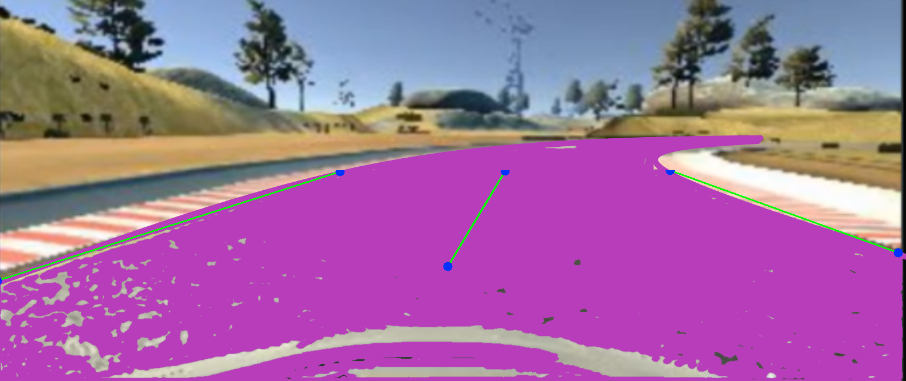

# camera algorithm
This algoritm is used to calculate the coordinates of roadborders and the middle of a segmented road.

## Installation
Python 3.x.
```
pip install opencv-python
pip install numpy
```
## Usage
The roadCoordinator class accepts 4 parameters.
1. Init the roadCoordinator
2. Use the first two parameters to crop the image until the road touches the top and bottom of the frame.
3. Use the last two parameters to select the low and high colors of the segmented road.
4. Use getRoadBorderCoordinates(frame) to get the road coordinates of a frame

## Parameter formats
    - minRoadHeight = number of pixel up from the bottom of the image
    - maxRoadHeight = number of pixel down from the top of the image
    - lowRoadColor = colorformat = [255,255,255]
    - highRoadColor = colorformat = [255,255,255]

## output format
(leftRoadBorder, rightRoadBorder, middleRoad)
The output is a tuple of 3 borders each border has a top and bottom coordinate:

    - leftRoadBorder -> (bottom:tuple, top:tuple)
    - rightRoadBorder -> (bottom:tuple, top:tuple)
    - middleRoad -> (bottom:tuple, top:tuple)

These bottom and top coordinates are tuples of X and Y:

    - bottom -> (x:int,y:int)
    - top -> (x:int,y:int)

This will be visualized as follows:
