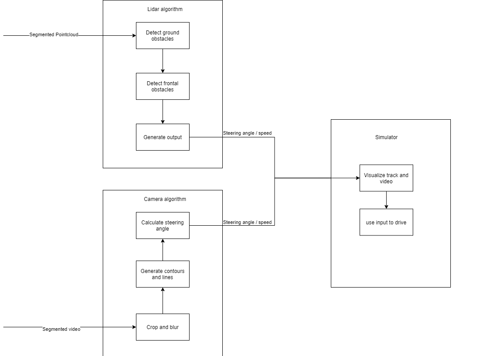

# Simulator
A simulator to simulate an autonomous car driving by camera or lidar input.

## Installation
- Python 3.x. 
- Install SimPyLC according to https://github.com/QQuick/SimPyLC
- Install other dependencies: 
```
    pip install PyInquirer
```
- Clone this repository.

## Usage
```Shell
cd simulator\simulations
python startSimulator.py
choose what you want to simulate
choose the track you want to drive on
```
## PID
The vehicle uses a PID to steer smoothly accros the track.
- It is possible to change the parameters realtime within the gui.
- You can also change the default values within utils.pid.py

## Camera pilot
The camera pilot simulates using the steering module by using a mp4 video feed. 
The steeringAngle is calculated by using the RoadCoordinator, 
the coordinates given are used with use the Pythagorean theorem to calculate the angle.

- The input consists of a video feed with already segmented road surface.
- The output is a target steering angle and target velocity.
- It is recommended to choose for "No.track"


## Lidar pilot
The lidar pilot is used to simulate a lidar which detects obstacles.
It works by using the lidar algorithm on a track with objects.

## tracks
You can add your own tracks or change the tracks inside the tracks folder.
Within the tracks are several obstacles with a given character:

    - '$' water
    - '*' road surface
    - '^' cones
    - '@' car
    
Tips: 
- If you want to change the objects visualisation or the dimensions of the tracks, you can do so in the visualisation.py
- You can also add your own simulation in the startSimulator.py by creating a new python module and adding the module as an answer to the answersList


